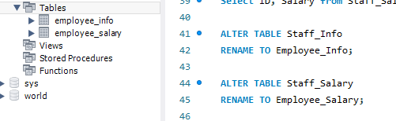
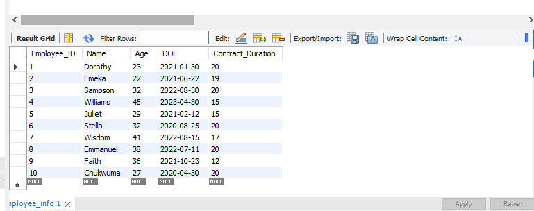
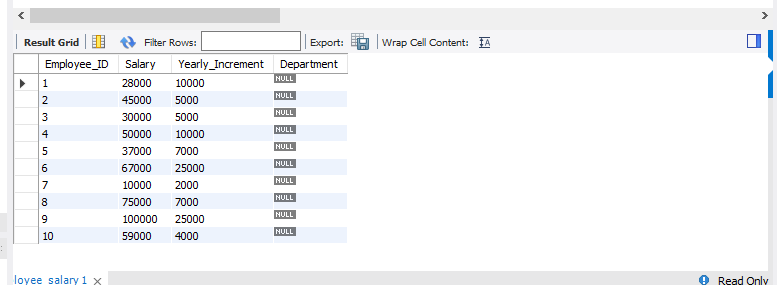
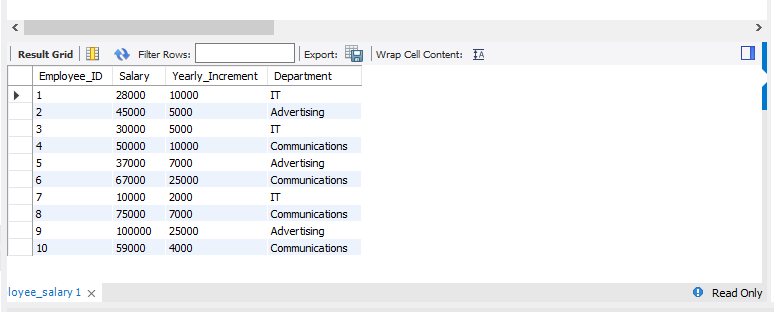
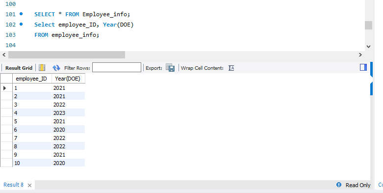
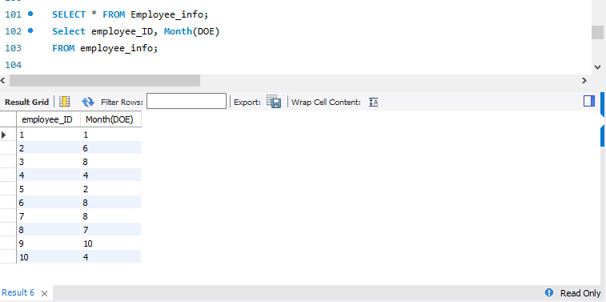
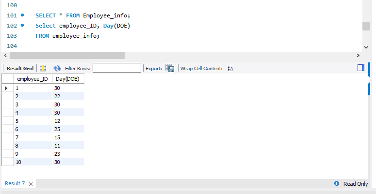
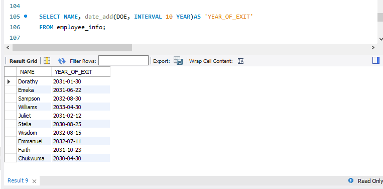

# Update/Modification of tables

## Introduction

One of the fundamental aspects of working with **SQL** databases, particularly MySQL, is the ability to update and modify tables. This task is a guide to understanding the manipulation of data withim MySQL tables, which entails utilizing SQL to effect changes to both the table structure and the data it contains.

## Problem Statement:
1. Rename the tables to Employee_Info and Employee_Salary
2. Change the ID columns to Employee_ID
3. Create a new column in the Employee_Salary named “Department”
4. For employees with the following ID’s, update their department with the ones specified 
- 1,3,7 IT
- 2,5,9 Advertising
- 4,6,8,10 Communications
5.	Change the data type of the IDs in both columns to Text data type
6.	Run a query that returns the month, Year and day each employee came into the company
7.	Return a query that adds 10 years to the year the employees came into the company as their year_of_exit.

The above snapshot shows the effective renaming of the tables from 'Staff_Info to ‘Employee_info’ and 'Staff_salary' to ‘Employee_Salary’. And this was done using the following syntax:

_ALTER TABLE Staff_Info_

_RENAME TO Employee_Info;_

_ALTER TABLE Staff_Salary_

_RENAME TO Employee_Salary;_

The above snapshot illustrates the modification made to the altered column 'ID', and the syntax used to achieve this is as follows.

_USE Staff;_

_ALTER TABLE employee_info_

_Rename column ID to Employee_ID;_

This syntax is used to make a change to the column name in the table.

The snapshot above shows the addition of a new column 'Department' to an existing table, and the syntax used the to carry out this is as foolows:

_SELECT * FROM employee_salary;_

_ALTER TABLE Employee_salary_

_ADD COLUMN Department Varchar(50);_

The above command was used to add a new column named 'Department to an existing table.

The above snapshot shows the updated table 'Department' using the employee_ID and the syntax used to achieve this is as follows;

_SELECT * FROM employee_salary;_

_UPDATE employee_salary_

_SET Department = "IT"_

_WHERE Employee_ID =3;_

The abovecommand updates the 'Department' column based on the specified conditions for different 'employee_ID'S in the table.

Adjusted model      |      Auto-model
:------------------:|:--------------------------------------:
       

The snapshot above show the command ran to show the year, month, and day.

The above snapshot shows a query tat added ten years to the "DOE" (Date of Entry) in the employee_Info table.

## Conclusion

The process of updating and modifying tables within **SQL** is an essential aspect of database management. 

Through tasks such as renaming tables, changing columns, inserting values into tables, one gains essential skills in database manipulation using **SQL**. 

